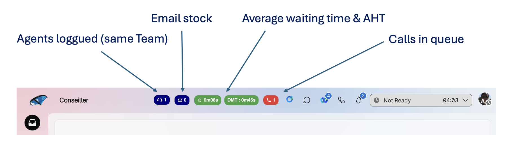

# Webex Contact Center - Header Widgets

Demo Assets - not production ready - and delivered "as-is" allow you to display some real time KPIs in Webex Contact Center Agent Desktop header such as : 
- number of calls in queue
- average time in queue and average handle time for voice
- email stock (emails in queue) 




## Repository Structure

```
Readme.MD
├── src/           
│   └── callsinqueue.js
│   └── awtaht4voice.js
│   └── emailstock.js
├── images/                    
│   └── headerwidgets.png

```

## How to use this asset

- download the javascript of your choice
- adapt is to your queue names
- host it on a web server
- update your Desktop Layout JSON file


# "Email Stock" widget

## What the javascript file does

1/ The javascript dynamically retrieves information coming from the Desktop Layout JSON file :
- agent token
- Webex Contact Center datacenter region
- Webex orgid

```
var org = this.orgId;
var dc = this.dc.slice(4); // you will get "eu2" from "prodeu2" for instance
var access_token = this.token;
```

2/ The 3 variables will be employed to execute the Webex Contact Center REST API via the "Search" endpoint.

The Search endpoint relies on a GraphQL query to retrieve the number of emails in queue ("parked") for given queues since 14 days.
You will need to adapt the GraphQL query to point to your own queues using queue names.

```
{
  task(
    from: "${jMinus14Ms}"
    to: "${currentTimeMs}"
    timeComparator: createdTime
    filter: {
      and: [
        { channelType: { equals: email } }
        { status: { equals: "parked" } } 
        { direction: { equals: "inbound" } }
        { lastQueue: { name: { contains: "YOUR_EMAIL_QUEUE_NAME_HERE" } } }   
      ]
    }
    aggregations: [{ field: "id", type: count, name: "TotalStock" }]
  ) {
    tasks { aggregation { name value }
    }
  }
}
```

Note : you can generate the queue list dynamically by making an extra Webex Contact Center API call using the given agent token.
This will ensure that you only receive the queues that the logged-in agent is authorized to access.

3/ Refresh the query every 5 seconds

```
    this.intervalID = setInterval(() => {
        GetCallsInQueue({ token: access_token });
    }, 5000);
```

## Edit your Desktop Layout JSON file

To utilize it within the Agent Desktop, it is necessary to reference your web component in the header section of your Desktop Layout JSON file.
Add the following code and adjust the JavaScript file path to correspond with your web server.

```
    "area": {
      "advancedHeader": [
        ...
        {
          "comp": "stock-email-14j",
          "script": "https://yourwebserver/emailstock.js",
          "properties": {
              "token": "$STORE.auth.accessToken",
              "agentId": "$STORE.agent.agentDbId",
              "agentName": "$STORE.agent.agentName",
              "orgId": "$STORE.agent.orgId",
              "dc": "$STORE.app.datacenter",
              "teamId": "$STORE.agent.teamId",   
              "teamName": "STORE.agent.teamName"    
          }
        },
        ...
```

Note : not all the properties are used in the javascript code, feel free to remove unused ones.


# "Average Time In Queue and Average Handle Time" widget

## What the javascript file does

1/ The javascript dynamically retrieves information coming from the Desktop Layout JSON file :
- agent token
- Webex Contact Center datacenter region
- Webex orgid

```
var org = this.orgId;
var dc = this.dc.slice(4); // you will get "eu2" from "prodeu2" for instance
var access_token = this.token;
```

2/ The 3 variables will be employed to execute the Webex Contact Center REST API via the "Search" endpoint.

The Search endpoint relies on a GraphQL query to retrieve agregated "queueDuration" and "totalDuration" since 6am.
You will need to adapt the GraphQL query to point to your own queues using queue names.

```
{
  task(
    from: "${ceMatin6h}"
    to: "${currentTimeMs}"
    timeComparator: createdTime
    filter: {
      and: [
        { channelType: { equals: telephony } }
        { direction: { equals: "inbound" } }
        { 
            or: [
                { lastQueue: { name: { equals: "YOUR_VOICE_QUEUE_NAME1_HERE" } } }
                { lastQueue: { name: { equals: "YOUR_VOICE_QUEUE_NAME2_HERE" } } }
            ]
        }
      ]
    }
    aggregations: [
      { field: "queueDuration", type: average, name: "AverageQueueTime" }
      { field: "connectedDuration", type: average, name: "Talk"}
      { field: "holdDuration", type: average, name: "Hold"}
      { field: "wrapupDuration", type: average, name: "WrapUp"}
      { field: "consultDuration", type: average, name: "Consult"}
      { field: "conferenceDuration", type: average, name: "Conference"}
      { field: "consultToQueueDuration", type: average, name: "ConsultToQueue"}
    ]
  ) {
    tasks { aggregation { name value }
    }
  }
}
```

Note : you can generate the queue list dynamically by making an extra Webex Contact Center API call using the given agent token.
This will ensure that you only receive the queues that the logged-in agent is authorized to access.

Calculation : Average Handle Time = Talk Time + Hold Time + Consult Time + Conference Time + ConsultToQueue Time + WrapUp Time.
If you are interested in other task metrics you can find some in our samples available here : https://github.com/WebexSamples/webex-contact-center-api-samples/tree/main/reporting-samples/graphql-sample.

3/ Display color-coded KPIs.

Average queue time KPI will be green if < 2 minutes. Red otherwise.
Average Handle time KPI will be green if < 2m30s. Red otherwise.
You can adapt the code (duration in milliseconds) in the section below : 

```
            let isAlert = AverageQueueTime > 120000;
            let bgColor = isAlert ? "#e53935" : "#43a047";
            let isAlert2 = AHT > 150000;
            let bgColor2 = isAlert2 ? "#e53935" : "#43a047";
```

4/ Refresh the query every 5 seconds

```
    this.intervalID = setInterval(() => {
        GetCallsInQueue({ token: access_token });
    }, 5000);
```

## Edit your Desktop Layout JSON file

To utilize it within the Agent Desktop, it is necessary to reference your web component in the header section of your Desktop Layout JSON file.
Add the following code and adjust the JavaScript file path to correspond with your web server.

```
    "area": {
    "advancedHeader": [
        ...
        {
          "comp": "stats-en-file",
          "script": "https://yourwebserver.com/awtaht.js",
          "properties": {
              "token": "$STORE.auth.accessToken",
              "agentId": "$STORE.agent.agentDbId",
              "agentName": "$STORE.agent.agentName",
              "orgId": "$STORE.agent.orgId",
              "dc": "$STORE.app.datacenter",
              "teamId": "$STORE.agent.teamId",   
              "teamName": "STORE.agent.teamName"    
          }
        },
        ...
```

Note : not all the properties are used in the javascript code, feel free to remove unused ones.


# "Calls in Queue" widget

## What the javascript file does

1/ The javascript dynamically retrieves information coming from the Desktop Layout JSON file :
- agent token
- Webex Contact Center datacenter region
- Webex orgid

```
var org = this.orgId;
var dc = this.dc.slice(4); // you will get "eu2" from "prodeu2" for instance
var access_token = this.token;
```

2/ The 3 variables will be employed to execute the Webex Contact Center REST API via the "Search" endpoint.

The Search endpoint relies on a GraphQL query to retrieve all active inbound calls in queues for given queues.
You will need to adapt the GraphQL query to point to your own queues using queue names.

```
{
  task(
    from: "1767874520000"
    to: "${currentTimeMs}"
     filter: {
      and: [
        { channelType: { equals: telephony } } 
        { isActive: { equals: true } }
        { status: { equals: "parked" } } 
        { direction: { equals: "inbound" } } 
        { 
            or: [
                { lastQueue: { name: { equals: "YOUR_VOICE_QUEUE_NAME1_HERE" } } }
                { lastQueue: { name: { equals: "YOUR_VOICE_QUEUE_NAME2_HERE" } } }
            ]
        }
      ]
    }
    aggregations: [{ field: "id", type: count, name: "NbCallsInQueue" }]
  ) {
    tasks {
      aggregation { name value }
    }
  }
}
```

Note : you can generate the queue list dynamically by making an extra Webex Contact Center API call using the given agent token.
This will ensure that you only receive the queues that the logged-in agent is authorized to access.

3/ Displays a color-coded KPI.

Green if 0. Red otherwise.
You can adapt the code here : 

```
    let isAlert = nbAppelsEnFile > 0;
    let bgColor = isAlert ? "#e53935" : "#43a047";
```

4/ Refresh the query every 5 seconds

```
    this.intervalID = setInterval(() => {
        GetCallsInQueue({ token: access_token });
    }, 5000);
```

## Edit your Desktop Layout JSON file

To utilize it within the Agent Desktop, it is necessary to reference your web component in the header section of your Desktop Layout JSON file.
Add the following code and adjust the JavaScript file path to correspond with your web server.

```
    "area": {
    "advancedHeader": [
        ...
        {
            "comp": "nb-appels-en-file",
            "script": "https://yourwebserver.com/callsinqueue.js",
            "properties": {
                "token": "$STORE.auth.accessToken",
                "agentId": "$STORE.agent.agentDbId",
                "agentName": "$STORE.agent.agentName",
                "orgId": "$STORE.agent.orgId",
                "dc": "$STORE.app.datacenter",
                "teamId": "$STORE.agent.teamId",   
                "teamName": "STORE.agent.teamName"    
            }
        },
      ...
```

Note : not all the properties are used in the javascript code, feel free to remove unused ones.

# Disclaimer

This archive is for educational and research purposes.

