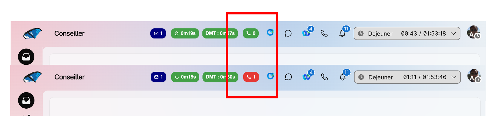

# Webex Contact Center - "Calls In Queue" Header Widget

Demo Asset - not production ready - and delivered "as-is" to display calls in queue in Webex Contact Center Agent Desktop Header.



## Repository Structure

```
Readme.MD
├── src/                    
│   └── callsinqueue.js
├── images/                    
│   └── callsinqueue.png

```

## What you need to do to use this asset

download callsinqueue.js
adapt is to your queue names.
host it on a web server.

## What the javascript file does

1/ The javascript dynamically retrieves information coming from the Desktop Layout JSON file :
- agent token
- datacenter where your Webex Contact Center is present
- orgid

```
var org = this.orgId;
var dc = this.dc.slice(4); // you will get "eu2" from "prodeu2" for instance
var access_token = this.token;
```

2/ Those 3 variables will be used to perform the Webex Contact Center REST API using the "Search" endpoint.

The Search endpoint relies on a GraphQL query to retrieve all active inbound calls in queues for given queues.
You will need to adapt the GraphQL query to point to your own queues using queue names.

```
{
  task(
    from: "1767874520000"
    to: "${currentTimeMs}"
     filter: {
      and: [
        { channelType: { equals: telephony } } 
        { isActive: { equals: true } }
        { status: { equals: "parked" } } 
        { direction: { equals: "inbound" } } 
        { 
            or: [
                { lastQueue: { name: { equals: "YOUR_VOICE_QUEUE_NAME1_HERE" } } }
                { lastQueue: { name: { equals: "YOUR_VOICE_QUEUE_NAME2_HERE" } } }
            ]
        }
      ]
    }
    aggregations: [{ field: "id", type: count, name: "NbCallsInQueue" }]
  ) {
    tasks {
      aggregation { name value }
    }
  }
}
```

Note : you can generate the queue list dynamically by making an extra Webex Contact Center API call using the given Agent Token.
This will ensure that you only receive the queues that the logged-in agent is authorized to access..

3/ Displays a color-coded KPI.

Green if 0. Red otherwise.
You can adapt the code here : 

```
    let isAlert = nbAppelsEnFile > 0;
    let bgColor = isAlert ? "#e53935" : "#43a047";
```

4/ Refresh the query every 5 seconds

```
    this.intervalID = setInterval(() => {
        GetCallsInQueue({ token: access_token });
    }, 5000);
```

## Edit your Desktop Layout JSON file

To use it inside the Agent Desktop, you will need to refer your web component in the header section of your Desktop Layout JSON file.
Add the following code and adapt the javascript file path to your web server.

```
    "area": {
    "advancedHeader": [
        ...
        {
            "comp": "nb-appels-en-file",
            "script": "https://yourwebserver.com/callsinqueue.js",
            "properties": {
                "token": "$STORE.auth.accessToken",
                "agentId": "$STORE.agent.agentDbId",
                "agentName": "$STORE.agent.agentName",
                "orgId": "$STORE.agent.orgId",
                "dc": "$STORE.app.datacenter",
                "teamId": "$STORE.agent.teamId",   
                "teamName": "STORE.agent.teamName"    
        }
    },
    ...
```

Note : not all the properties are used in the javascript code, feel free to remove unused ones.

## Disclaimer

This archive is for educational and research purposes.

## License

The transcripts are provided for personal and educational use. Please respect the original content creators' rights.
